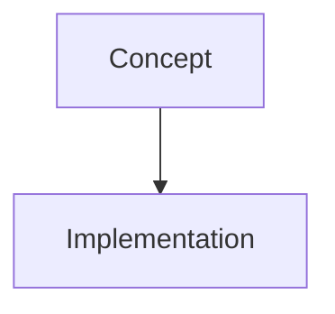

You are writing a computer science textbook chapter.

## INPUTS
- **Topic**: {{topic}}
- **Day Number**: {{day}}
- **PyDaily Lesson Content**: 
```
{{lesson_content}}
```

## TASK
Write a comprehensive theory section. This should feel like reading a university textbook - thorough, precise, but still accessible.

**CRITICAL INSTRUCTION:**
Start your response with EXACTLY this line:
`# {{topic}}`

Do NOT add "Day X" or any other creative title. Use the exact topic provided.

## OUTPUT STRUCTURE

### What You'll Learn
- Bullet point 1 (key concept)
- Bullet point 2 (key skill)
- Bullet point 3 (practical application)
- Bullet point 4 (interview relevance) [optional]

### Theory

Start with a **real-world analogy** to ground the concept.

Then explain the concept thoroughly (800-1200 words):
- What is it?
- Why does it exist?
- How does Python implement it?

Include an **"Under the Hood"** subsection explaining:
- How Python internally handles this
- Memory considerations
- Performance characteristics

### Diagrams

Include Mermaid diagrams where helpful:


## IMAGE PLACEHOLDERS

When a visual diagram would be helpful, use this exact format:

<!-- IMAGE_PLACEHOLDER: IMG_CH{{day:02d}}_01 -->
<!-- DESCRIPTION: A detailed, high-quality prompt for an AI image generator (Midjourney/DALL-E). Describe the scene, objects, lighting, and style (e.g. "Minimalist tech illustration of a Python list structure, flat design, dark mode colors"). Do NOT explain the concept here, just describe the visual. -->

DO NOT include any "Suggested URLs". We are generating custom images.

## TONE
Academic but approachable. Like MIT OpenCourseWare or "Fluent Python" by Luciano Ramalho.

## FORMAT
Return as Markdown with proper headings (##, ###).
Use code blocks with syntax highlighting for Python code.
